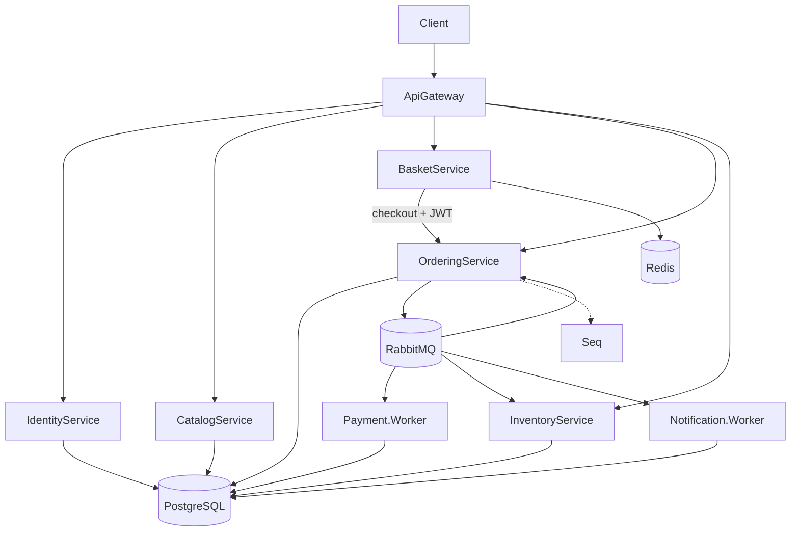

# Microservices.Ecommerce

[](https://github.com/luismpenholato/Microservices.Ecommerce/actions/workflows/ci.yml)
[](https://dotnet.microsoft.com/)
[](LICENSE)

E-commerce distribuído em **.NET 10** para demonstrar microserviços com **Clean Architecture**, mensageria, consistência eventual, JWT, outbox transacional e observabilidade — pronto para clonar, validar e apresentar em portfólio.

## Visão geral

| Área | Tecnologias |
|------|-------------|
| APIs | ASP.NET Core, YARP (Gateway) |
| Mensageria | RabbitMQ, MassTransit |
| Dados | PostgreSQL (database per service), Redis (carrinho) |
| Auth | JWT, BCrypt, IdentityService dedicado |
| Ops | Serilog/Seq, Prometheus, Grafana, health checks, runbooks |

## Arquitetura



Fluxo assíncrono do pedido (resumo): checkout → `OrderCreatedEvent` → pagamento → reserva de estoque → `OrderCompletedEvent` → notificação.

Documentação completa: [docs/architecture.md](docs/architecture.md)

## Quick Start

**Pré-requisitos:** Docker Desktop (ou Docker Engine + Compose v2), .NET 10 SDK (opcional para build local).

```bash
git clone https://github.com/luismpenholato/Microservices.Ecommerce.git
cd Microservices.Ecommerce
docker compose up -d --build
```

| Serviço | URL |
|---------|-----|
| ApiGateway | http://localhost:5000 |
| Identity | http://localhost:5005 |
| Grafana | http://localhost:3000 (admin/admin) |
| Seq | http://localhost:5341 |
| RabbitMQ UI | http://localhost:15672 (guest/guest) |

Catálogo público: http://localhost:5000/catalog/products

## Validate local environment

Scripts automatizam health, métricas e rotas básicas:

```powershell
.\scripts\validate-local.ps1
```

```bash
chmod +x scripts/validate-local.sh && ./scripts/validate-local.sh
```

Com checkout E2E (login + JWT + fluxo completo):

```powershell
.\scripts\validate-local.ps1 -RunCheckoutFlow
```

```bash
./scripts/validate-local.sh --run-checkout-flow
```

## E2E checkout flow

1. Login no Identity → `accessToken` + `customerId`
2. `GET /catalog/products` (público)
3. `POST /basket/.../items` e `checkout` com `Authorization: Bearer`
4. Polling `GET /ordering/orders/{id}` até `Completed`
5. Logs no Seq e métricas no Grafana

Roteiro detalhado: [docs/smoke-tests.md](docs/smoke-tests.md) · Exemplos curl: [docs/examples/http-requests.md](docs/examples/http-requests.md)

## Credenciais demo

| Perfil | E-mail | Senha |
|--------|--------|-------|
| Cliente | `demo@ecommerce.local` | `Demo123!` |
| Admin | `admin@ecommerce.local` | `Admin123!` |

```bash
curl -s -X POST http://localhost:5000/identity/auth/login \
  -H "Content-Type: application/json" \
  -d '{"email":"demo@ecommerce.local","password":"Demo123!"}'
```

## Padrões implementados

| Padrão | Onde |
|--------|------|
| Database per Service | Um banco PostgreSQL por serviço com estado |
| API Gateway | YARP — roteamento e JWT na borda |
| Transactional Outbox | Ordering, Payment, Inventory |
| Idempotency-Key | Checkout Basket → Ordering |
| Consumer idempotente | `(EventId, ConsumerName)` na mesma transação |
| Retry + filas `_error` | MassTransit — replay manual |
| Clean Architecture | Api / Application / Domain / Infrastructure |

ADRs: [docs/decisions/](docs/decisions/)

## Serviços

| Serviço | Porta (host) | Persistência |
|---------|--------------|--------------|
| ApiGateway | 5000 | — |
| Identity | 5005 | `identity_db` |
| Catalog | 5001 | `catalog_db` |
| Basket | 5002 | Redis |
| Ordering | 5003 | `ordering_db` |
| Inventory | 5004 | `inventory_db` |
| Payment.Worker | 5010 (ops) | `payment_db` |
| Notification.Worker | 5011 (ops) | `notification_db` |

## Observabilidade

- **Logs:** Serilog → Seq — [guia](docs/observability-seq.md)
- **Métricas:** `ecommerce_*` em `/metrics` — Prometheus + Grafana — [guia](docs/observability-prometheus.md)
- **Health:** `/health/live`, `/health/ready`
- **Runbooks:** [docs/runbooks/](docs/runbooks/) · [operations](docs/operations.md)

## Segurança

- IdentityService dedicado (register/login/me)
- JWT com claims `sub`, `email`, `customer_id`, `role`
- Gateway: basket/ordering protegidos; catalog GET público; catalog write = Admin
- Basket/Ordering validam `customerId` da URL contra o token

Detalhes: [docs/security.md](docs/security.md)

## Testes

```bash
dotnet test                                    # todos (Docker para integração)
dotnet test tests/Catalog.UnitTests tests/Basket.UnitTests tests/Ordering.UnitTests
```

| Suite | Docker |
|-------|--------|
| `*UnitTests` | Não |
| `IntegrationTests` | Sim (Testcontainers) |
| `Security.IntegrationTests` | Sim |

CI no GitHub Actions: build + unitários + integração. Ver [docs/testing.md](docs/testing.md).

## Estrutura do repositório

```
src/
  ApiGateway/
  BuildingBlocks/
  Services/          # Catalog, Basket, Ordering, Identity, Payment, Inventory, Notification
tests/
  *UnitTests, IntegrationTests, Security.IntegrationTests
infra/               # Prometheus, Grafana, Postgres init
docs/                # Arquitetura, segurança, testes, runbooks
scripts/             # validate-local.ps1 / .sh
docker-compose.yml
```

## Trade-offs

| Benefício | Custo |
|-----------|-------|
| Serviços independentes e evolução por contexto | Complexidade operacional e debugging distribuído |
| Outbox + idempotência robustos | Latência e estados intermediários visíveis |
| Stack completa de observabilidade | Mais componentes no `docker compose` |
| JWT simples (HMAC) para portfólio | Segredo compartilhado — ver [ROADMAP](ROADMAP.md) para JWKS |

## Roadmap

Itens futuros (não implementados): refresh token, JWT assimétrico, Alertmanager, contract tests, rate limiting, Kubernetes/Aspire, e mais — [ROADMAP.md](ROADMAP.md).

## Documentação

| Documento | Conteúdo |
|-----------|----------|
| [architecture.md](docs/architecture.md) | Visão técnica e diagramas |
| [service-communication.md](docs/service-communication.md) | HTTP vs eventos, outbox, retry |
| [security.md](docs/security.md) | JWT, roles, credenciais demo |
| [testing.md](docs/testing.md) | Estratégia e CI |
| [operations.md](docs/operations.md) | Health, métricas, validação |
| [smoke-tests.md](docs/smoke-tests.md) | Fluxo manual ponta a ponta |

## Contribuindo

Veja [CONTRIBUTING.md](CONTRIBUTING.md).

## Licença

[MIT](LICENSE) — Copyright (c) 2026 Luis Penholato
