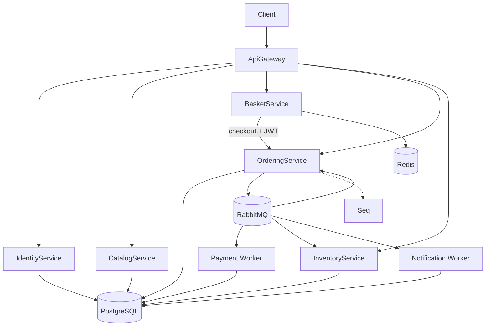

# Microservices.Ecommerce

[](https://github.com/luismpenholato/Microservices.Ecommerce/actions/workflows/ci.yml)
[](https://dotnet.microsoft.com/)
[](LICENSE)

Production-like e-commerce microservices platform built with .NET 10, ASP.NET Core, YARP API Gateway, RabbitMQ, MassTransit, PostgreSQL, Redis, JWT authentication, Transactional Outbox, idempotent consumers, Docker Compose, and structured observability.

## Purpose

This repository is a **portfolio / open-source reference project**. It demonstrates distributed e-commerce patterns with production-like characteristics — not a turnkey commercial platform. Clone it, run it locally with Docker Compose, explore the code, and use it to showcase microservices architecture in interviews and GitHub profiles.

## Architecture overview



Full technical documentation: [docs/architecture.md](docs/architecture.md)

## Services

| Service | Type | Responsibility | Persistence |
|---------|------|----------------|-------------|
| **ApiGateway** | API | YARP reverse proxy, JWT at the edge | — |
| **IdentityService** | API | Register / login / JWT issuance | PostgreSQL `identity_db` |
| **CatalogService** | API | Product catalog | PostgreSQL `catalog_db` |
| **BasketService** | API | Shopping cart + HTTP checkout | Redis |
| **OrderingService** | API | Order lifecycle + integration events | PostgreSQL `ordering_db` + outbox |
| **Payment.Worker** | Worker | Simulated payment processing | PostgreSQL `payment_db` + outbox |
| **InventoryService** | API | Stock and reservation | PostgreSQL `inventory_db` + outbox |
| **Notification.Worker** | Worker | Simulated notifications | PostgreSQL `notification_db` |

## Runtime architecture

- **ApiGateway** (`http://localhost:5000`) is the single external HTTP entry point.
- **IdentityService** issues JWTs consumed by the gateway and downstream services.
- **PostgreSQL** — one database per stateful service (`identity_db`, `catalog_db`, `ordering_db`, `inventory_db`, `payment_db`, `notification_db`).
- **Redis** — ephemeral basket state.
- **RabbitMQ + MassTransit** — async integration between Ordering, Payment, Inventory, and Notification.
- **Seq, Prometheus, Grafana** — local observability stack.

## Business flow

1. Customer browses the public catalog.
2. Customer authenticates via Identity and receives a JWT.
3. Customer adds items to the basket (Redis).
4. Checkout creates an order in Ordering (HTTP + `Idempotency-Key`).
5. Ordering publishes `OrderCreatedEvent` via the transactional outbox.
6. Payment.Worker approves or rejects payment.
7. InventoryService reserves stock.
8. Ordering completes the order and publishes `OrderCompletedEvent`.
9. Notification.Worker logs a simulated notification.

## Checkout flow

1. `POST /identity/auth/login` → `accessToken` + `customerId`
2. `GET /catalog/products` (public)
3. `POST /basket/baskets/{customerId}/items` with `Authorization: Bearer`
4. `POST /basket/baskets/{customerId}/checkout`
5. Poll `GET /ordering/orders/{orderId}` until status is `Completed`

Detailed walkthrough: [docs/smoke-tests.md](docs/smoke-tests.md) · curl examples: [docs/examples/http-requests.md](docs/examples/http-requests.md)

## Messaging and consistency

| Pattern | Where |
|---------|-------|
| Transactional Outbox | Ordering, Payment, Inventory |
| Idempotency-Key | Basket → Ordering checkout |
| Idempotent consumers | `(EventId, ConsumerName)` in the same DB transaction |
| Retry + `_error` queues | MassTransit — manual replay |

ADRs: [docs/decisions/](docs/decisions/) · Communication details: [docs/service-communication.md](docs/service-communication.md)

## Authentication and authorization

- **IdentityService** — register, login, `/me`
- JWT claims: `sub`, `email`, `customer_id`, `role`
- **Gateway** — basket and ordering routes require JWT; catalog GET is public; catalog write requires Admin
- Basket and Ordering validate URL `customerId` against the token

Details: [docs/security.md](docs/security.md)

## Observability

| Signal | Tool | Endpoint |
|--------|------|----------|
| Logs | Serilog → Seq | http://localhost:5341 |
| Metrics | Prometheus + Grafana | `/metrics` on each service; Grafana http://localhost:3000 |
| Health | ASP.NET Core | `/health/live`, `/health/ready` |

Guides: [docs/observability.md](docs/observability.md) · [Seq](docs/observability-seq.md) · [Prometheus/Grafana](docs/observability-prometheus.md) · Runbooks: [docs/runbooks/](docs/runbooks/)

## Testing strategy

| Suite | Project | Docker required |
|-------|---------|-----------------|
| Unit | `Catalog.UnitTests`, `Basket.UnitTests`, `Ordering.UnitTests` | No |
| Integration | `IntegrationTests` | Yes (Testcontainers) |
| Security | `Security.IntegrationTests` | Yes (Testcontainers) |

```bash
dotnet test tests/Catalog.UnitTests tests/Basket.UnitTests tests/Ordering.UnitTests
dotnet test tests/IntegrationTests tests/Security.IntegrationTests   # requires Docker
```

CI runs build and unit tests on every push/PR. Integration and security tests are available locally with Docker — see [docs/testing.md](docs/testing.md).

## Running with Docker Compose

**Prerequisites:** Docker Desktop (or Docker Engine + Compose v2). .NET 10 SDK is optional for running containers only.

```bash
git clone https://github.com/luismpenholato/Microservices.Ecommerce.git
cd Microservices.Ecommerce
docker compose up -d --build
```

| Service | URL |
|---------|-----|
| ApiGateway | http://localhost:5000 |
| Identity | http://localhost:5005 |
| Grafana | http://localhost:3000 (admin/admin) |
| Seq | http://localhost:5341 |
| RabbitMQ UI | http://localhost:15672 (guest/guest) |
| Prometheus | http://localhost:9090 |

Public catalog: http://localhost:5000/catalog/products

## Validate the local environment

After `docker compose up -d --build`, wait for healthchecks (`docker compose ps`) and follow the manual checklist in [docs/smoke-tests.md](docs/smoke-tests.md). Quick checks:

```bash
curl -s http://localhost:5000/health/ready
curl -s http://localhost:5000/catalog/products
```

For the full checkout flow, see [docs/examples/http-requests.md](docs/examples/http-requests.md).

## Demo credentials

> **Local demo only.** Do not use these credentials outside a local environment.

| Role | Email | Password |
|------|-------|----------|
| Customer | `demo@ecommerce.local` | `Demo123!` |
| Admin | `admin@ecommerce.local` | `Admin123!` |

```bash
curl -s -X POST http://localhost:5000/identity/auth/login \
  -H "Content-Type: application/json" \
  -d '{"email":"demo@ecommerce.local","password":"Demo123!"}'
```

## Service ports

| Service | Host port | Database / store |
|---------|-----------|------------------|
| ApiGateway | 5000 | — |
| Catalog | 5001 | `catalog_db` |
| Basket | 5002 | Redis |
| Ordering | 5003 | `ordering_db` |
| Inventory | 5004 | `inventory_db` |
| Identity | 5005 | `identity_db` |
| Payment.Worker | 5010 | `payment_db` |
| Notification.Worker | 5011 | `notification_db` |
| PostgreSQL | 5432 | all databases |
| Redis | 6379 | basket |
| RabbitMQ | 5672 / 15672 (UI) | — |
| Seq | 5341 | — |
| Prometheus | 9090 | — |
| Grafana | 3000 | — |

## Repository structure

```
src/
  ApiGateway/
  BuildingBlocks/       # Contracts, Domain, Messaging, Observability, Web
  Services/             # Catalog, Basket, Ordering, Identity, Payment, Inventory, Notification
tests/
  *UnitTests, IntegrationTests, Security.IntegrationTests
infra/                  # Prometheus, Grafana, Postgres init
docs/                   # Architecture, security, testing, runbooks, ADRs
docker-compose.yml
```

## CI

GitHub Actions workflow [`.github/workflows/ci.yml`](.github/workflows/ci.yml):

1. **build** — restore and build the solution
2. **unit-tests** — `Catalog`, `Basket`, `Ordering` unit tests

Integration and security tests are **not** run in CI (require Docker locally). Run them manually when needed.

## Documentation

| Document | Content |
|----------|---------|
| [architecture.md](docs/architecture.md) | Technical overview and diagrams |
| [service-communication.md](docs/service-communication.md) | HTTP vs events, outbox, retry |
| [security.md](docs/security.md) | JWT, roles, demo credentials |
| [testing.md](docs/testing.md) | Test strategy and CI |
| [operations.md](docs/operations.md) | Health, metrics, validation |
| [smoke-tests.md](docs/smoke-tests.md) | Manual end-to-end flow |
| [deployment.md](docs/deployment.md) | Deployment notes (local/demo scope) |

## Conscious trade-offs

| Benefit | Cost |
|---------|------|
| Independent services and bounded contexts | Operational complexity and distributed debugging |
| Robust outbox + idempotency | Visible intermediate states and latency |
| Full local observability stack | More containers in `docker compose` |
| Simple HMAC JWT for portfolio demos | Shared secret across services — see [ROADMAP](ROADMAP.md) for JWKS |

## Roadmap

Implemented features are documented above. Planned items (refresh tokens, asymmetric JWT, Alertmanager, contract tests, Kubernetes/Aspire, and more) are tracked in [ROADMAP.md](ROADMAP.md).

## License

[MIT](LICENSE) — Copyright (c) 2026 Luis Penholato
