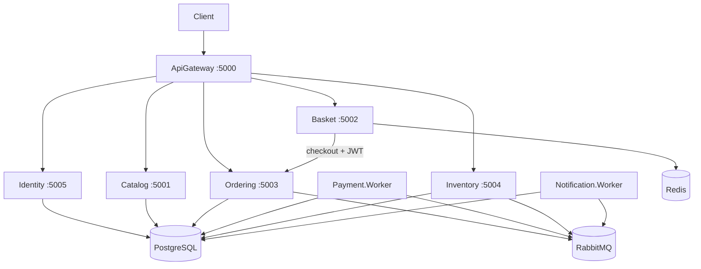

# Arquitetura — Microservices.Ecommerce

Documentação relacionada: [service-communication.md](./service-communication.md) · [security.md](./security.md) · [testing.md](./testing.md) · [operations.md](./operations.md) · [ADRs](./decisions/)

## Visão geral

E-commerce distribuído em **.NET 10** com padrões próximos de produção local:

- **Database per Service** (PostgreSQL isolado por serviço com estado)
- **Transactional Outbox** para publicação confiável de eventos
- **Idempotency-Key** no checkout (Basket → Ordering)
- **Consumers transacionalmente idempotentes** (`EventId` + `ConsumerName`, índice único composto)
- **RabbitMQ + MassTransit** para processos assíncronos
- **API Gateway** (YARP) como entrada HTTP única
- **Clean Architecture** em cada serviço (regra de negócio em Application/Domain, não em Controller/Consumer)

## Serviços e responsabilidades

| Serviço | Tipo | Responsabilidade | Persistência |
|---------|------|------------------|--------------|
| **ApiGateway** | API | Roteamento HTTP (YARP) + JWT na borda | — |
| **IdentityService** | API | Register/Login JWT | PostgreSQL `identity_db` |
| **CatalogService** | API | Catálogo de produtos | PostgreSQL `catalog_db` |
| **BasketService** | API | Carrinho temporário + checkout HTTP | Redis |
| **OrderingService** | API | Ciclo de vida do pedido | PostgreSQL `ordering_db` + outbox |
| **Payment.Worker** | Worker | Simulação de pagamento | PostgreSQL `payment_db` + outbox |
| **InventoryService** | API | Estoque e reserva | PostgreSQL `inventory_db` + outbox |
| **Notification.Worker** | Worker | Notificações simuladas | PostgreSQL `notification_db` |

## Padrões críticos

### Transactional Outbox

Pedido/evento de integração e registro na tabela `outbox_messages` são gravados na **mesma transação**. Um `BackgroundService` (`OutboxDispatcher`) publica no RabbitMQ, incrementa `RetryCount` em falha e define `ProcessedAtUtc` somente após publicação bem-sucedida. Índice único em `EventId` reduz duplicidade na fila.

Ver [ADR 0006](./decisions/0006-transactional-outbox.md).

### Idempotency-Key (checkout)

O Basket envia o header `Idempotency-Key` (derivado de `customerId` + hash do carrinho). O Ordering persiste em `order_idempotency_records`:

- Mesma chave + mesmo payload → retorna o mesmo `OrderId` (200/201)
- Mesma chave + payload diferente → **409 Conflict**

Ver [ADR 0007](./decisions/0007-idempotency-key.md).

### Idempotência transacional de consumers

Cada consumer herda `TransactionalIdempotentConsumer<TEvent>` e executa via `IIntegrationEventUnitOfWork`:

1. Inicia transação
2. Se `(EventId, ConsumerName)` já existe → ignora com log estruturado
3. Executa handler (Application)
4. Grava `processed_integration_events` na mesma transação
5. Commit

Em caso de exceção no handler, a transação é revertida e o evento **não** é marcado como processado (MassTransit reentrega).

PK composta `(EventId, ConsumerName)` evita race condition entre instâncias.

### Retry e error queues (camadas separadas)

| Camada | Configuração | Comportamento |
|--------|--------------|---------------|
| **Consumer** | `MessageBusOptions` | `UseMessageRetry` no MassTransit; falha não grava `processed_integration_events` |
| **Outbox** | `OutboxOptions` | `OutboxDispatcher` incrementa `RetryCount`; sucesso → `ProcessedAtUtc` |

Após esgotar retry do consumer, mensagem vai para **`{endpoint}_error`** no RabbitMQ. Não há compensação automática; replay é operação manual.

`IntegrationEventConsumeObserver` registra falhas técnicas (`MessageType`, `ConsumerName`, `EventId`, `CorrelationId`, `OrderId`). Handlers Application mantêm logs de negócio.

`IConsumerExecutionFaultHook` (NoOp em produção) permite simular falha transitória em testes sem vazar lógica para Application.

Ver [ADR 0008](./decisions/0008-retry-dlq-error-queues.md) e [observability-seq.md](./observability-seq.md).

## Comunicação

### Síncrona (HTTP)

- Cliente → ApiGateway → Catalog / Basket / Ordering / Inventory / Identity
- **Basket → Ordering** no checkout (retorno imediato do `orderId` + idempotência; Bearer repassado ao Ordering)

### Segurança (JWT)

- **IdentityService** emite JWT (BCrypt para senhas; segredo via `Jwt:Secret` / variáveis de ambiente).
- **ApiGateway** valida JWT e aplica regras por rota (`GatewayAuthorizationMiddleware`).
- **Basket/Ordering** validam JWT novamente (defesa em profundidade) e usam claim `customer_id`.
- **Catalog**: GET público; POST/PUT exige role `Admin`.
- **Inventory**: leitura/ajuste públicos no demo (justificativa: observabilidade de estoque sem fricção em portfólio; proteger em produção).

Claims: `sub`, `email`, `customer_id`, `role`.

### Assíncrona (eventos)

| Evento | Publicado por | Consumido por |
|--------|---------------|---------------|
| `OrderCreatedEvent` | Ordering (outbox) | Payment.Worker |
| `PaymentApprovedEvent` / `PaymentRejectedEvent` | Payment (outbox) | Ordering, Inventory |
| `StockReservedEvent` / `StockReservationFailedEvent` | Inventory (outbox) | Ordering |
| `OrderCompletedEvent` / `OrderCancelledEvent` | Ordering (outbox) | Notification.Worker |

## Consistência eventual

Cada serviço mantém estado próprio. Status em Ordering pode ficar temporariamente defasado em relação a Payment/Inventory — esperado. Outbox + idempotência de consumers garantem **at-least-once** sem efeitos colaterais duplicados na maioria dos casos.

## Observabilidade e operação

- Logs estruturados (Serilog → Seq): `OrderId`, `EventId`, `CorrelationId`, `ConsumerName`, `MessageType`
- Health: `/health/live` (apenas processo), `/health/ready` (PostgreSQL, Redis, RabbitMQ conforme serviço)
- Métricas `ecommerce_*` em `/metrics` (Prometheus + Grafana no compose)
- Workers expõem `/health/live`, `/health/ready`, `/metrics` sem controllers
- OpenTelemetry (OTLP opcional, Prometheus habilitado por padrão no Docker)
- Runbooks: [docs/runbooks/](./runbooks/) — [operations.md](./operations.md)

## Diagrama de deploy (Docker Compose)

## Testes

Detalhes em [testing.md](./testing.md).

## Decisões

ADRs em [decisions/](./decisions/), em especial:

- [0006 — Transactional Outbox](./decisions/0006-transactional-outbox.md)
- [0007 — Idempotency-Key](./decisions/0007-idempotency-key.md)
- [0008 — Retry / error queues](./decisions/0008-retry-dlq-error-queues.md)

Veja também [service-communication.md](./service-communication.md).
