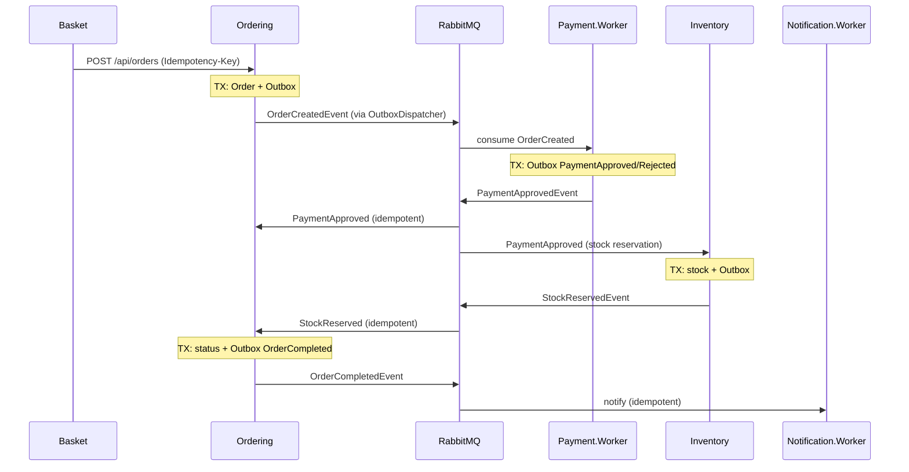
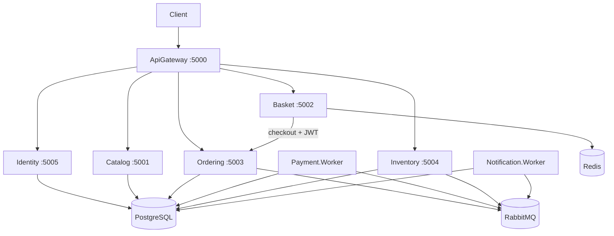

# Architecture — Microservices.Ecommerce

Related documentation: [service-communication.md](./service-communication.md) · [security.md](./security.md) · [testing.md](./testing.md) · [operations.md](./operations.md) · [ADRs](./decisions/)

## Overview

Distributed e-commerce built with **.NET 10** using patterns close to local production:

- **Database per Service** (isolated PostgreSQL per stateful service)
- **Transactional Outbox** for reliable event publishing
- **Idempotency-Key** on checkout (Basket → Ordering)
- **Transactionally idempotent consumers** (`EventId` + `ConsumerName`, composite unique index)
- **RabbitMQ + MassTransit** for asynchronous processes
- **API Gateway** (YARP) as the single HTTP entry point
- **Clean Architecture** in each service (business rules in Application/Domain, not in Controller/Consumer)

## Services and responsibilities

| Service | Type | Responsibility | Persistence |
|---------|------|----------------|-------------|
| **ApiGateway** | API | HTTP routing (YARP) + JWT at the edge | — |
| **IdentityService** | API | Register/Login JWT | PostgreSQL `identity_db` |
| **CatalogService** | API | Product catalog | PostgreSQL `catalog_db` |
| **BasketService** | API | Temporary cart + HTTP checkout | Redis |
| **OrderingService** | API | Order lifecycle | PostgreSQL `ordering_db` + outbox |
| **Payment.Worker** | Worker | Payment simulation | PostgreSQL `payment_db` + outbox |
| **InventoryService** | API | Stock and reservation | PostgreSQL `inventory_db` + outbox |
| **Notification.Worker** | Worker | Simulated notifications | PostgreSQL `notification_db` |

## Critical patterns

### Transactional Outbox

The order/integration event and the record in the `outbox_messages` table are written in the **same transaction**. A `BackgroundService` (`OutboxDispatcher`) publishes to RabbitMQ, increments `RetryCount` on failure, and sets `ProcessedAtUtc` only after successful publication. A unique index on `EventId` reduces duplication in the queue.

See [ADR 0006](./decisions/0006-transactional-outbox.md).

### Idempotency-Key (checkout)

Basket sends the `Idempotency-Key` header (derived from `customerId` + cart hash). Ordering persists it in `order_idempotency_records`:

- Same key + same payload → returns the same `OrderId` (200/201)
- Same key + different payload → **409 Conflict**

See [ADR 0007](./decisions/0007-idempotency-key.md).

### Transactional consumer idempotency

Each consumer inherits `TransactionalIdempotentConsumer<TEvent>` and executes via `IIntegrationEventUnitOfWork`:

1. Starts a transaction
2. If `(EventId, ConsumerName)` already exists → skips with structured log
3. Runs handler (Application)
4. Writes `processed_integration_events` in the same transaction
5. Commit

If the handler throws, the transaction is rolled back and the event is **not** marked as processed (MassTransit redelivers).

Composite PK `(EventId, ConsumerName)` prevents race conditions between instances.

### Retry and error queues (separate layers)

| Layer | Configuration | Behavior |
|-------|---------------|----------|
| **Consumer** | `MessageBusOptions` | `UseMessageRetry` in MassTransit; failure does not write `processed_integration_events` |
| **Outbox** | `OutboxOptions` | `OutboxDispatcher` increments `RetryCount`; success → `ProcessedAtUtc` |

After consumer retry is exhausted, the message goes to **`{endpoint}_error`** in RabbitMQ. There is no automatic compensation; replay is a manual operation.

`IntegrationEventConsumeObserver` logs technical failures (`MessageType`, `ConsumerName`, `EventId`, `CorrelationId`, `OrderId`). Application handlers keep business logs.

`IConsumerExecutionFaultHook` (NoOp in production) allows simulating transient failure in tests without leaking logic into Application.

See [ADR 0008](./decisions/0008-retry-dlq-error-queues.md) and [observability-seq.md](./observability-seq.md).

## Communication

### Synchronous (HTTP)

- Client → ApiGateway → Catalog / Basket / Ordering / Inventory / Identity
- **Basket → Ordering** on checkout (immediate `orderId` response + idempotency; Bearer forwarded to Ordering)

### Security (JWT)

- **IdentityService** issues JWT (BCrypt for passwords; secret via `Jwt:Secret` / environment variables).
- **ApiGateway** validates JWT and applies per-route rules (`GatewayAuthorizationMiddleware`).
- **Basket/Ordering** validate JWT again (defense in depth) and use the `customer_id` claim.
- **Catalog**: GET is public; POST/PUT requires `Admin` role.
- **Inventory**: public read/adjust in the demo (rationale: stock observability without friction in a portfolio project; protect in production).

Claims: `sub`, `email`, `customer_id`, `role`.

### Asynchronous (events)

| Event | Published by | Consumed by |
|-------|--------------|-------------|
| `OrderCreatedEvent` | Ordering (outbox) | Payment.Worker |
| `PaymentApprovedEvent` / `PaymentRejectedEvent` | Payment (outbox) | Ordering, Inventory |
| `StockReservedEvent` / `StockReservationFailedEvent` | Inventory (outbox) | Ordering |
| `OrderCompletedEvent` / `OrderCancelledEvent` | Ordering (outbox) | Notification.Worker |

## Eventual consistency

Each service maintains its own state. Status in Ordering may temporarily lag behind Payment/Inventory — this is expected. Outbox + consumer idempotency provide **at-least-once** delivery without duplicate side effects in most cases.

## Observability and operations

- Structured logs (Serilog → Seq): `OrderId`, `EventId`, `CorrelationId`, `ConsumerName`, `MessageType`
- Health: `/health/live` (process only), `/health/ready` (PostgreSQL, Redis, RabbitMQ per service)
- `ecommerce_*` metrics at `/metrics` (Prometheus + Grafana in compose)
- Workers expose `/health/live`, `/health/ready`, `/metrics` without controllers
- OpenTelemetry (optional OTLP, Prometheus enabled by default in Docker)
- Runbooks: [docs/runbooks/](./runbooks/) — [operations.md](./operations.md)

## Deployment diagram (Docker Compose)

## Tests

Details in [testing.md](./testing.md).

## Decisions

ADRs in [decisions/](./decisions/), especially:

- [0006 — Transactional Outbox](./decisions/0006-transactional-outbox.md)
- [0007 — Idempotency-Key](./decisions/0007-idempotency-key.md)
- [0008 — Retry / error queues](./decisions/0008-retry-dlq-error-queues.md)

See also [service-communication.md](./service-communication.md).
