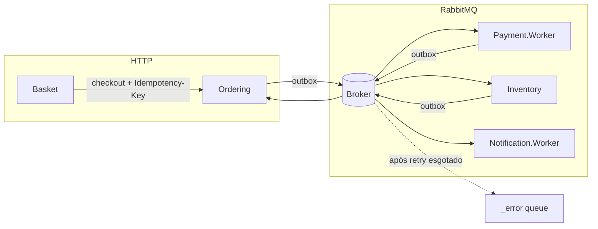

# Comunicação entre serviços

## Quando usar HTTP

- Consultas imediatas (listar produtos, obter pedido, consultar estoque)
- Checkout do carrinho (cliente precisa do `orderId` na resposta)
- Header obrigatório no checkout: `Idempotency-Key` (gerado pelo Basket)
- Header obrigatório nas rotas protegidas: `Authorization: Bearer {jwt}` (ver [security.md](./security.md))

## Quando usar eventos

- Pagamento, estoque, notificação e transições de status do pedido
- Processos que podem falhar e ser reprocessados (retry + idempotência transacional)

## Contratos

Todos os eventos de integração estão em `BuildingBlocks.Contracts` e incluem:

- `EventId` — idempotência no consumer (`EventId` + `ConsumerName`)
- `CorrelationId` — rastreamento distribuído (Seq, OpenTelemetry)
- `OccurredOnUtc` — auditoria

## Publicação confiável (Outbox)

Serviços com banco **não** publicam direto no handler:

1. Gravam o evento em `outbox_messages` na mesma transação do estado.
2. `OutboxDispatcher` publica no RabbitMQ com retry próprio (`OutboxOptions`).

Configuração separada do retry de consumer (`MessageBusOptions`).

## Retry e error queues (MassTransit + RabbitMQ)

### Consumer

| Configuração | Seção | Padrão local |
|--------------|-------|--------------|
| Tentativas de retry | `MessageBus:RetryLimit` | 3 |
| Intervalo | `MessageBus:RetryIntervalSeconds` | 2s |

Comportamento:

1. Handler falha → transação revertida → **não** grava `processed_integration_events`.
2. MassTransit reentrega até `RetryLimit`.
3. Após esgotar → mensagem na fila **`{endpoint}_error`** (kebab-case).

Exemplo de endpoint: `ordering-service-payment-approved-consumer` → fila de erro `ordering-service-payment-approved-consumer_error`.

### Outbox

| Configuração | Seção | Padrão local |
|--------------|-------|--------------|
| Máx. falhas de publish | `Outbox:MaxPublishRetries` | 5 |
| Intervalo de poll | `Outbox:PollIntervalSeconds` | 2s |

Mensagem permanece pendente (`ProcessedAtUtc` nulo) até sucesso ou esgotar retries de publicação.

## Reprocessamento e DLQ

- **Não** há compensação automática ao ir para `_error`.
- **Não** há replay automático para o fluxo de negócio.
- Reprocessamento é **manual** (operador): inspecionar fila `_error` no RabbitMQ Management, corrigir causa, requeue ou republicar com consciência de idempotência.

Ver [ADR 0008](./decisions/0008-retry-dlq-error-queues.md).

## Falhas técnicas vs. negócio

| Tipo | Quem loga | Exemplo |
|------|-----------|---------|
| Técnica (consume fault) | `IntegrationEventConsumeObserver` | Timeout, exceção de infra |
| Negócio | Handlers em Application | Pagamento rejeitado, estoque insuficiente |

## Correlation ID

- Header HTTP: `X-Correlation-Id`
- Propagado em eventos de integração
- Consultas Seq: ver [observability-seq.md](./observability-seq.md)

## Diagrama resumido

