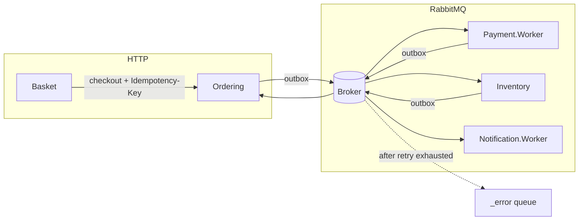

# Service communication

## When to use HTTP

- Immediate queries (list products, get order, check stock)
- Cart checkout (client needs `orderId` in the response)
- Required header on checkout: `Idempotency-Key` (generated by Basket)
- Required header on protected routes: `Authorization: Bearer {jwt}` (see [security.md](./security.md))

## When to use events

- Payment, inventory, notification, and order status transitions
- Processes that can fail and be reprocessed (retry + transactional idempotency)

## Contracts

All integration events live in `BuildingBlocks.Contracts` and include:

- `EventId` — consumer idempotency (`EventId` + `ConsumerName`)
- `CorrelationId` — distributed tracing (Seq, OpenTelemetry)
- `OccurredOnUtc` — audit

## Reliable publishing (Outbox)

Services with a database do **not** publish directly from the handler:

1. They write the event to `outbox_messages` in the same transaction as state.
2. `OutboxDispatcher` publishes to RabbitMQ with its own retry (`OutboxOptions`).

Separate configuration from consumer retry (`MessageBusOptions`).

## Retry and error queues (MassTransit + RabbitMQ)

### Consumer

| Setting | Section | Local default |
|---------|---------|---------------|
| Retry attempts | `MessageBus:RetryLimit` | 3 |
| Interval | `MessageBus:RetryIntervalSeconds` | 2s |

Behavior:

1. Handler fails → transaction rolled back → **does not** write `processed_integration_events`.
2. MassTransit redelivers until `RetryLimit`.
3. After exhaustion → message in **`{endpoint}_error`** queue (kebab-case).

Example endpoint: `ordering-service-payment-approved-consumer` → error queue `ordering-service-payment-approved-consumer_error`.

### Outbox

| Setting | Section | Local default |
|---------|---------|---------------|
| Max publish failures | `Outbox:MaxPublishRetries` | 5 |
| Poll interval | `Outbox:PollIntervalSeconds` | 2s |

Message stays pending (`ProcessedAtUtc` null) until success or publish retries are exhausted.

## Reprocessing and DLQ

- **No** automatic compensation when a message goes to `_error`.
- **No** automatic replay for the business flow.
- Reprocessing is **manual** (operator): inspect the `_error` queue in RabbitMQ Management, fix the cause, requeue or republish with idempotency in mind.

See [ADR 0008](./decisions/0008-retry-dlq-error-queues.md).

## Technical vs. business failures

| Type | Who logs | Example |
|------|----------|---------|
| Technical (consume fault) | `IntegrationEventConsumeObserver` | Timeout, infrastructure exception |
| Business | Handlers in Application | Payment rejected, insufficient stock |

## Correlation ID

- HTTP header: `X-Correlation-Id`
- Propagated in integration events
- Seq queries: see [observability-seq.md](./observability-seq.md)

## Summary diagram

